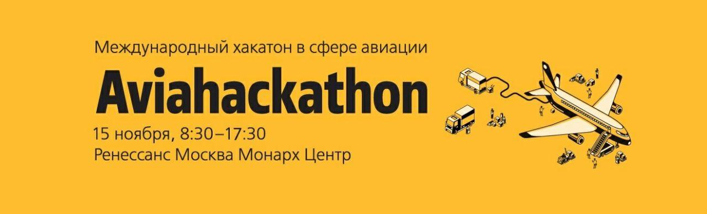

# АвиаХакатон

## Задачи
- [Геймификация в электронных каналах продаж. (задача от Utair)](https://github.com/lambdamai/aviahackathon/issues/1)
- [Определения безопасного места для посадки беспилотника. (задача от Copter Express)](https://github.com/lambdamai/aviahackathon/issues/2)
- [Стратегия взаимодействия контентного сайта и соцсетей. (задача от Авиатранспортное обозрение)](https://github.com/lambdamai/aviahackathon/issues/3)
- [Matchmaking для вылетающих. (задача от ГОСНИИ ГА)](https://github.com/lambdamai/aviahackathon/issues/4)
- [C-check обслуживание самолёта. (задача от МАИ)](https://github.com/lambdamai/aviahackathon/issues/5)
- [Create a tool to track international rocket launch information. (the task from the MAI)](https://github.com/lambdamai/aviahackathon/issues/6)

## Номинации 
